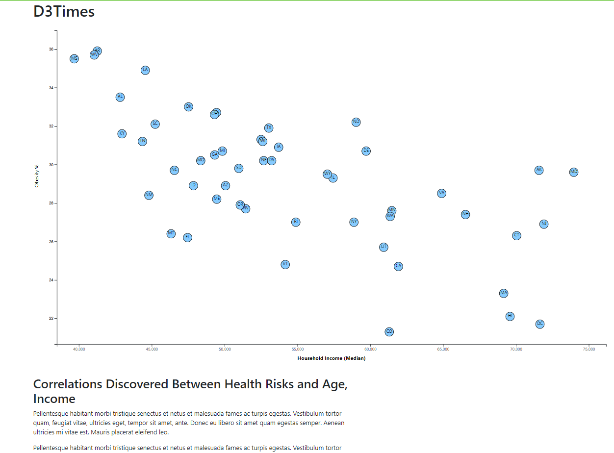

# D3-Challenge
## Using D3 to make interactive graphs

### About this project
* Use of data visualization with D3 to analyze data about health trends and income, or lack thereof, and its effects. 
* Used US Census Bureau and Behavioral Risk Factor Surveillance System data to create the analysis.

## Technologies Used
* HTML
* Javascript
* D3
* CSV

### How it was used
* Created Scatter Plot with Circles for each state
* Each circle was plotted for two values
* Analysis was visible based on the values chosen
* Tool tips were placed with the values

